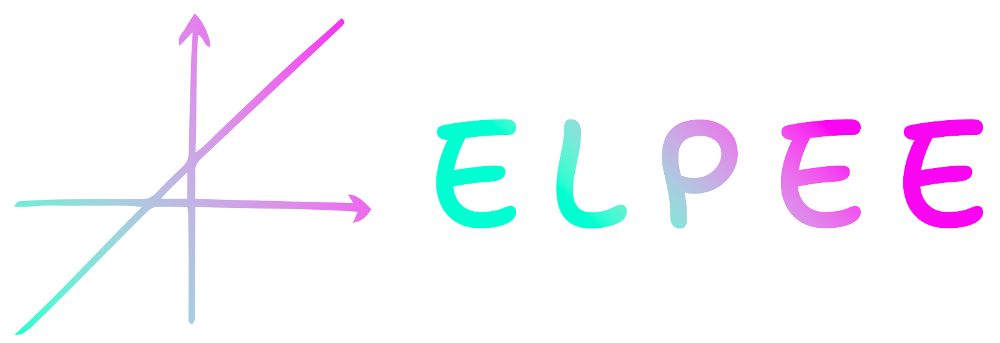

Solving LP problems with Steps 
==============================

1. Set-up the Linear Programming (LP) problem to be solved according to maximization or minimization

.. code-block:: python

    from elpee import LinearProblem

    # set up a maximization problem
    problem = LinearProblem(is_maximization=True)

2. Define the Objective function for the LP problem to be optimized
    
.. code-block:: python

    # define the objective function
    problem.add_objective('x + y')

3. Define all constraints (either a `>=`, `<=` or `=` mathematical expression) for the LP problem to be optimized

.. code-block:: python

    # add the constraints to the problem
    problem.add_constraint('-x + y <= 2')
    problem.add_constraint('6*x + 4*y >= 24')
    problem.add_constraint('y >= 1')

4. [Optional] Add additional configurations to apply Big-M or Dual Simplex Method. The configuration will change the nature of the steps needed to solve problems with `>=` or `=` constraints.

For using dual simplex method

.. code-block:: python

    # use to configure problem to use dual simplex method
    problem.use_dual_simplex()

*Or* For using big-M method

.. code-block:: python

    # use to configure problem to use big M method
    problem.use_bigM()

5. Apply the Solver to solve the Linear Problem. The iterations to produce the results will be printed on the command line.

.. code-block:: python

    from elpee import elpee_solver

    solution = elpee_solver.solve(problem)

The output received will follow the format below

.. code-block:: console

    ...Generating Initial Feasible Solution for
        MIN           x            y            S1           S2           S3          Sol
        P           -1.0         -1.0          0            0            0            0
        S1          -1.0         1.0           1            0            0           2.0
        S2          -6.0         -4.0          0            1            0          -24.0
        S3           0           -1.0          0            0            1           -1.0
    ===========================================================================================

    Taking S2 = 0; Entering x as a new basic variable;

    ...Generating Initial Feasible Solution for
        MIN           x            y            S1           S2           S3          Sol
        P           0.0         -0.333        0.0         -0.167        0.0          4.0
        S1          0.0         1.667         1.0         -0.167        0.0          6.0
        x           1.0         0.667         -0.0        -0.167        -0.0         4.0
        S3           0           -1.0          0            0            1           -1.0
    ===========================================================================================

    Taking S3 = 0; Entering y as a new basic variable;

    Feasible Solution # 1
        MIN           x            y            S1           S2           S3          Sol
        P           0.0          0.0          0.0         -0.167       -0.333       4.333
        S1          0.0          0.0          1.0         -0.167       1.667        4.333
        x           1.0          0.0          0.0         -0.167       0.667        3.333
        y           -0.0         1.0          -0.0         -0.0         -1.0         1.0
    ===========================================================================================

    Optimized Solution Received!

    Minimum Value for Objective Function = 4.333

    Values for Decision Variables :
        x       = 3.333
        y       = 1.0

    Surplus & Slack variables
    Constraint #1 Surplus    = 4.333 units
    Constraint #2 Surplus    : Satisfied at Boundary
    Constraint #3 Surplus    : Satisfied at Boundary
